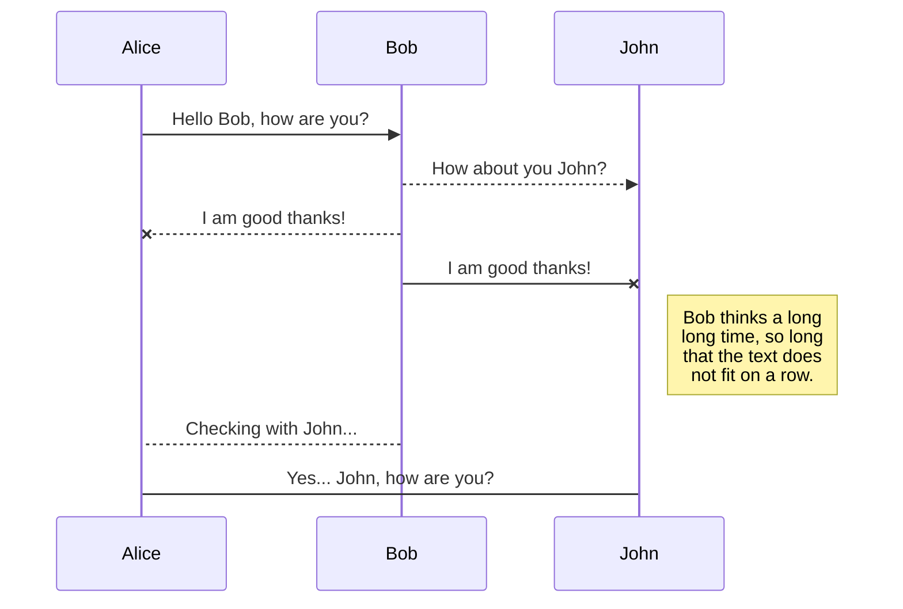
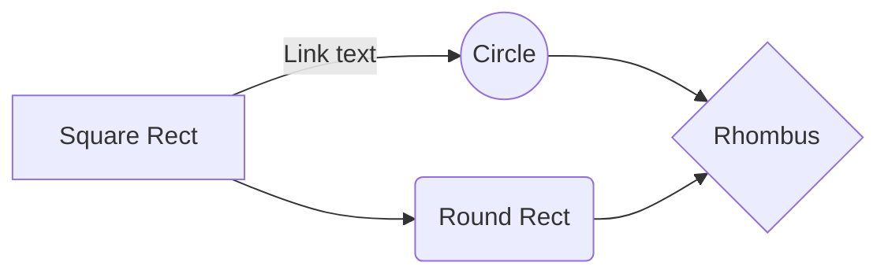

# How to install Node.js and MongoDB on EC2 the hard way

Hi! I got tired of reading guides on the internet that do no explain anything properly. And sorry to say this but the EC2 docs suck at explaining anything. This guide is designed for people who are total newbies to the whole world of Amazon, Ubuntu, NGINX and what not. **Even if you read 300 more articles on the Internet** I assure you, **this one post will blow away all of them.** **Bookmark this!** If this post needs an update, [open an issue](https://github.com/slidenerd/ec2-mean-test/issues) So are you ready? Great! Strap your seat belts, this s gonna be one heck of a ride! 

After lots and lots of Googling, this is going to be the most comprehensive post that shows the following. 
 1. How to setup **Ubuntu 18.04** instance on Amazon EC2
 2. **Setup SSH keys** between your local machine and Amazon EC2
 3. How to install **Node.js using NVM** on this instance
 4. How to install MongoDB on the primary partition of this instance but data, journal and logs will be stored on different partitions using EBS Volumes?
 5. How to **optimize** **MongoDB for linux**?
 6. How to **secure** the installed **MongoDB** database?
 7. Setup SSH keys between your local machine and GitHub
 8. Setup SSH keys between GitHub and your EC2 instance
 9. How to install **NGINX** to handle traffic on port 80?
 10. How to setup **PM2** to handle process management in production for our website?
 11. Setup Elastic IP before getting a domain name
 12. How to setup a custom domain with **Godaddy**?
 13. How to setup **FREE SSL** on the custom domain using **LetsEncrypt/Certbot**? 

# Step 1: Setup Ubuntu instance on EC2

**We are going to install Ubuntu 18.04 on EC2**. Why not Amazon Linux or Amazon Linux 2? Perhaps, some [SUGGESTIONS](https://serverfault.com/questions/197927/amazon-ec2-ami-recommendations-for-free-tier) from serverfault would help. Report Broken Link

 1. Amazon Linux seems to be maintained independently by Amazon as per [THIS](https://serverfault.com/questions/275736/amazon-linux-vs-ubuntu-for-amazon-ec2) server-fault answer. Report Broken Link
 2. We would prefer that are we not dependent on a single entity for updates to the OS which happens to be Amazon here.
 3. Here is another server-fault Answer that compares [Ubuntu vs Amazon Linux.](https://serverfault.com/questions/275736/amazon-linux-vs-ubuntu-for-amazon-ec2) Report Broken Link
 4. Ubuntu updates more frequently. 
 5. We don't know exactly if Amazon Linux is optimized for our use case or not but any claims for optimization must always be backed by benchmarks specific to our case which we don't have at the moment.

## Create an Account on AWS

 1. Pretty simple and straight forward thing to do.
 2. Enter email
 3. Enter password
 4. Enter card details (No don't worry, they won't charge you, you are covered by the 1 year FREE tier plan that applies to the services we use in this tutorial)
 5. Questions about the Free Tier are answered by Amazon [HERE](https://aws.amazon.com/free/free-tier-faqs/) Report Broken Link
 6. I have not included any screenshots till the end of this process and there is nothing really new here. Let's move on.

## Go to your Dashboard

## Rename a file

You can rename the current file by clicking the file name in the navigation bar or by clicking the **Rename** button in the file explorer.

## Delete a file

You can delete the current file by clicking the **Remove** button in the file explorer. The file will be moved into the **Trash** folder and automatically deleted after 7 days of inactivity.

## Export a file

You can export the current file by clicking **Export to disk** in the menu. You can choose to export the file as plain Markdown, as HTML using a Handlebars template or as a PDF.

# Synchronization

Synchronization is one of the biggest features of StackEdit. It enables you to synchronize any file in your workspace with other files stored in your **Google Drive**, your **Dropbox** and your **GitHub** accounts. This allows you to keep writing on other devices, collaborate with people you share the file with, integrate easily into your workflow... The synchronization mechanism takes place every minute in the background, downloading, merging, and uploading file modifications.

There are two types of synchronization and they can complement each other:

- The workspace synchronization will sync all your files, folders and settings automatically. This will allow you to fetch your workspace on any other device.
	> To start syncing your workspace, just sign in with Google in the menu.

- The file synchronization will keep one file of the workspace synced with one or multiple files in **Google Drive**, **Dropbox** or **GitHub**.
	> Before starting to sync files, you must link an account in the **Synchronize** sub-menu.

## Open a file

You can open a file from **Google Drive**, **Dropbox** or **GitHub** by opening the **Synchronize** sub-menu and clicking **Open from**. Once opened in the workspace, any modification in the file will be automatically synced.

## Save a file

You can save any file of the workspace to **Google Drive**, **Dropbox** or **GitHub** by opening the **Synchronize** sub-menu and clicking **Save on**. Even if a file in the workspace is already synced, you can save it to another location. StackEdit can sync one file with multiple locations and accounts.

## Synchronize a file

Once your file is linked to a synchronized location, StackEdit will periodically synchronize it by downloading/uploading any modification. A merge will be performed if necessary and conflicts will be resolved.

If you just have modified your file and you want to force syncing, click the **Synchronize now** button in the navigation bar.

> **Note:** The **Synchronize now** button is disabled if you have no file to synchronize.

## Manage file synchronization

Since one file can be synced with multiple locations, you can list and manage synchronized locations by clicking **File synchronization** in the **Synchronize** sub-menu. This allows you to list and remove synchronized locations that are linked to your file.

# Publication

Publishing in StackEdit makes it simple for you to publish online your files. Once you're happy with a file, you can publish it to different hosting platforms like **Blogger**, **Dropbox**, **Gist**, **GitHub**, **Google Drive**, **WordPress** and **Zendesk**. With [Handlebars templates](http://handlebarsjs.com/), you have full control over what you export.

> Before starting to publish, you must link an account in the **Publish** sub-menu.

## Publish a File

You can publish your file by opening the **Publish** sub-menu and by clicking **Publish to**. For some locations, you can choose between the following formats:

- Markdown: publish the Markdown text on a website that can interpret it (**GitHub** for instance),
- HTML: publish the file converted to HTML via a Handlebars template (on a blog for example).

## Update a publication

After publishing, StackEdit keeps your file linked to that publication which makes it easy for you to re-publish it. Once you have modified your file and you want to update your publication, click on the **Publish now** button in the navigation bar.

> **Note:** The **Publish now** button is disabled if your file has not been published yet.

## Manage file publication

Since one file can be published to multiple locations, you can list and manage publish locations by clicking **File publication** in the **Publish** sub-menu. This allows you to list and remove publication locations that are linked to your file.

# Markdown extensions

StackEdit extends the standard Markdown syntax by adding extra **Markdown extensions**, providing you with some nice features.

> **ProTip:** You can disable any **Markdown extension** in the **File properties** dialog.

## SmartyPants

SmartyPants converts ASCII punctuation characters into "smart" typographic punctuation HTML entities. For example:

|                |ASCII                          |HTML                         |
|----------------|-------------------------------|-----------------------------|
|Single backticks|`'Isn't this fun?'`            |'Isn't this fun?'            |
|Quotes          |`"Isn't this fun?"`            |"Isn't this fun?"            |
|Dashes          |`-- is en-dash, --- is em-dash`|-- is en-dash, --- is em-dash|

## KaTeX

You can render LaTeX mathematical expressions using [KaTeX](https://khan.github.io/KaTeX/):

The *Gamma function* satisfying $\Gamma(n) = (n-1)!\quad\forall n\in\mathbb N$ is via the Euler integral

$$
\Gamma(z) = \int_0^\infty t^{z-1}e^{-t}dt\,.
$$

> You can find more information about **LaTeX** mathematical expressions [here](http://meta.math.stackexchange.com/questions/5020/mathjax-basic-tutorial-and-quick-reference).

## UML diagrams

You can render UML diagrams using [Mermaid](https://mermaidjs.github.io/). For example, this will produce a sequence diagram:

And this will produce a flow chart:

<!--stackedit_data:
eyJoaXN0b3J5IjpbMjA1MTk2NDQyMSw0MzUxMDAxMDksLTc1Nj
Y4MzEzNCw1MzU5Nzk0MywtODEzNjg4Njk2LDQ1NjE1MjAxMiwx
MzQ3NzQxOTYyLDU0MTUxODQ0MCwzMTk4NDU0MDAsMjY1NTMwNz
EwLDI1MzQ5MTEyNiwtMTc0MzQ2NDQ2OV19
-->