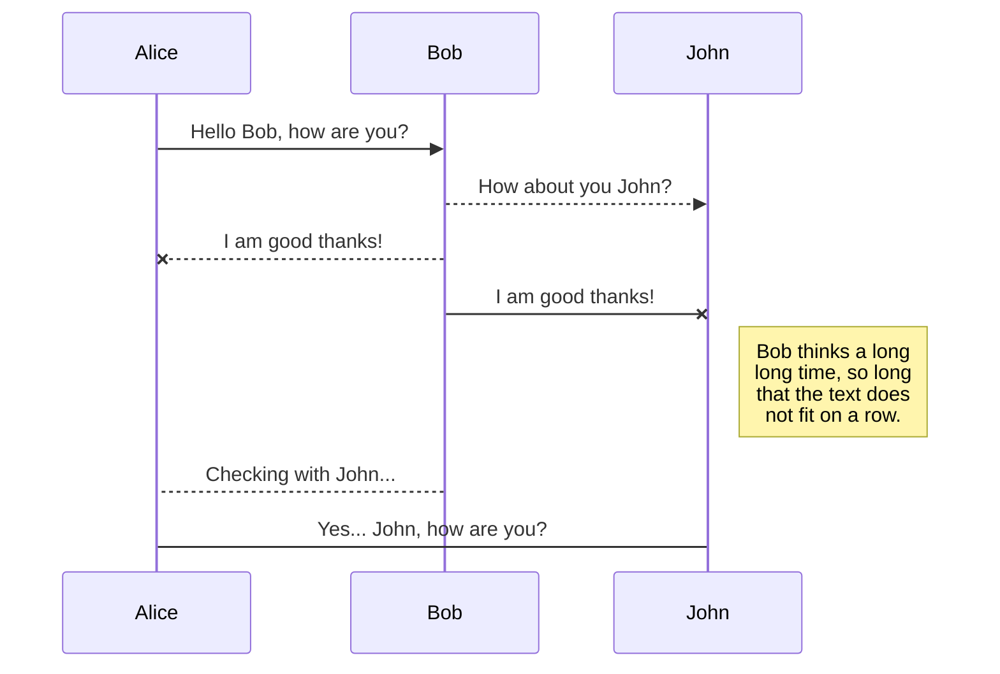
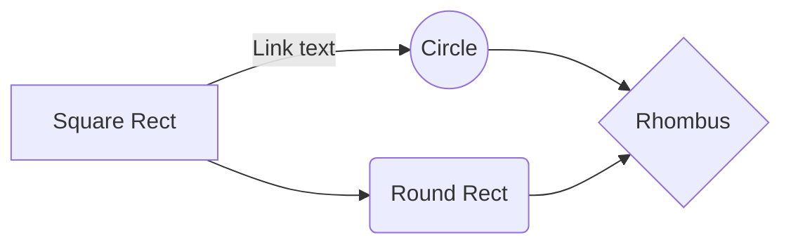

# How to install Node.js and MongoDB on EC2 the production hard way

Hi! I got tired of reading guides on the internet that do no explain anything properly. And sorry to say this but the EC2 docs suck at explaining anything. This guide is designed for people who are total newbies to the whole world of Amazon, Ubuntu, NGINX, LetsEncrypt and what not.

>  **Even if you read 300 more articles on the Internet** I assure you, **this one post will blow away all of them.** **Bookmark it!**

If this post needs an update, [open an issue](https://github.com/slidenerd/ec2-mean-test/issues) Lets GOO!!!

## **About my local machine**
 1. Experience has taught me that these types of tutorials are super dependent on what my local machine, version etc etc is.
 2. I am on OSX High Sierra 10.13.6
 3. If you are using Windows, some of the steps such as SSH setup will vary significantly but you will be able to follow through the rest of this guide.
 4. If you are on Windows, check [THIS](https://stackoverflow.com/questions/10287337/ssh-to-amazon-ec2-instance-using-putty-in-windows) answer for setting up SSH connection with EC2. Report Broken Link

## What are we doing in this post ?
 1. How to setup **Ubuntu 18.04** instance on Amazon EC2
 2. **Setup SSH keys** between your local machine and Amazon EC2
 3. How to install **Node.js using NVM** on this instance
 4. How to install MongoDB on the primary partition of this instance but data, journal and logs will be stored on different partitions using EBS Volumes?
 5. How to **optimize** **MongoDB for linux**?
 6. How to **secure** the installed **MongoDB** database?
 7. Setup SSH keys between your local machine and GitHub
 8. Setup SSH keys between GitHub and your EC2 instance
 9. How to install **NGINX** to handle traffic on port 80?
 10. How to setup **PM2** to handle process management in production for our website?
 11. Setup Elastic IP before getting a domain name
 12. How to setup a custom domain with **Godaddy**?
 13. How to setup **FREE SSL** on the custom domain using **LetsEncrypt/Certbot**? 

# Step 1: Setup Ubuntu instance on EC2

**We are going to install Ubuntu 18.04 on EC2**. Why not Amazon Linux or Amazon Linux 2? Perhaps, some [SUGGESTIONS](https://serverfault.com/questions/197927/amazon-ec2-ami-recommendations-for-free-tier) from serverfault would help. Report Broken Link

 1. Amazon Linux seems to be maintained independently by Amazon as per [THIS](https://serverfault.com/questions/275736/amazon-linux-vs-ubuntu-for-amazon-ec2) server-fault answer. Report Broken Link
 2. We would prefer that are we not dependent on a single entity for updates to the OS which happens to be Amazon here.
 3. Here is another server-fault Answer that compares [Ubuntu vs Amazon Linux.](https://serverfault.com/questions/275736/amazon-linux-vs-ubuntu-for-amazon-ec2) Report Broken Link
 4. Ubuntu updates more frequently. 
 5. We don't know exactly if Amazon Linux is optimized for our use case or not but any claims for optimization must always be backed by benchmarks specific to our case which we don't have at the moment.

## Create an Account on AWS

 1. Easy Peasy Lemon Squeezy.
 2. Enter email
 3. Enter password
 4. Enter card details (No don't worry, they won't charge you, you are covered by the 1 year FREE tier plan that applies to the services we use in this tutorial)
 5. Questions about the Free Tier are answered by Amazon [HERE](https://aws.amazon.com/free/free-tier-faqs/) Report Broken Link
 6. I have not included any screenshots till the end of this process and there is nothing really new here. Let's move on.

## Go to your Dashboard

 1. Whew! That looks overwhelming doesn't it?
 2. Worry, not, [HERE](https://hackernoon.com/understanding-amazon-ec2-terminology-85be19d0af28) is a post explaining the various tabs and terminology. Report Broken Link
 3. My account is setup in Ohio, you could be in a different region and the process will remain more or less the same.
 4. **WARNING**! Changing the region means EC2 folks will email you to confirm the same which takes time.

## Step 1: Choose Amazon Machine Image

 1. Notice how the **"Free tier only"** option on the left is checked. 
 2. Also notice on the right hand side of the screen, we got a bunch of select buttons and some of them have an option 64-bit x86 and 64-bit arm.
 3. EC2 offers x86 and ARM processors and you can find more about them [HERE](https://lmgtfy.com/?q=ec2%20x86%20vs%20arm). Report Broken Link
 4. We go ahead with x86 for the time being.
 5. Click **Select** and let's proceed

## Step 2: Choose an Instance Type

 1. Instance type dictates how much memory your instance will have.
 2. We have selected t2.micro here which seems to be the only one eligible on Free Tier at the moment.
 3. You can check the specs and pricing of t2.micro [HERE](https://lmgtfy.com/?q=ec2%20t2%20micro%20specs) Report Broken Link
 4. Click on **"Next Configure Instance Details"** and proceed

## Step 3: Configure Instance

 1. Now this page has some really complex settings but luckily we don't have to tweak any of them.
 2. If you are curious about what these settings mean, feel free to Google each one.
 3. Now we click on **Next: Add Storage** and proceed.

# Step 4: Add Storage

This is one of the most important steps in our tutorial so far. You have several choices to decide how MongoDB is run. Let me list them out for you.
 1. Use MongoDB from a third party Database-As-A-Service provider such as MLabs, Compose etc. (No thanks,we'll pass)
 2. Create a separate instance that only hosts MongoDB. (This will cost us in the Free Tier to have more than once instance running)
 3. Install MongoDB + everything else on the same partition. (Simplest possible setup but not scalable in the long run when your DB starts growing)
 4. Install MongoDB + everything else on the  same partition but let the database, journal files and logs be stored in separate partitions to accommodate our ever growing collections. **(BINGO! That is the approach we are going to follow)**
**We are going to use EBS to setup 3 additional volumes of 16 GB, 4 GB and 2 GB.**
 5. Amazon offers Elastic Block Storage Volumes (EBS Volumes).
 6. Think of EBS Volumes as portable hard drives on your PC. One of them is getting full? No probems, just buy another one and start storing data in it.

 7. We get 30 GB (as of writing this post) for our instance out of which 8GB has been allocated to our instance. This 8GB will store our OS files for Ubuntu, Node, Nginx, Certbot and other tools and updates plus MongoDB (without the actual database)
 8. We still have 22 GB left which we can allocate separately to EBS Volumes as 16GB (data) + 4GB (journal) + 2GB (logs)
 9. To do so, click on **Add New Volume** where you will be able to add 16, 4, 2 GB one by one.
  
 10. The above screen now represents my added volumes.
 11. Notice how **Delete on Termination** is set only for the primary volume. As you probably guessed, if you terminate the instance, you will lose all the data on that volume. If you are not sure about the difference between stopping and terminating the instance, [HERE](https://docs.rightscale.com/faq/clouds/aws/Whats_the_difference_between_Terminating_and_Stopping_an_EC2_Instance.html) you go. Report Broken Link
 12. [HERE](https://stackoverflow.com/questions/2549035/do-you-get-charged-for-a-stopped-instance-on-ec2/10419883#10419883) is another answer on stackoverflow that discusses the billing for terminated vs stopped instances. Report Broken Link
 13. if you already have a running instance and did not do this step, no worries, go to your **Dashboard** and you will see a Volumes Section which allows you to do the same thing.
 14. Click on **Next: Add Tags** and let's proceed

# Step 5: Add Tags

Tags are just used to find objects like instances, volumes etc. We add a single tag whose key is *name* and value is *node mongo production instance*

Click **Next: Configure Security Group** and let's proceed

# Step 6: Configure Security Group

 1. Security Groups are analogous to a Firewall with differences of course.
 2. In case, you are wondering if you need both, [HERE](https://serverfault.com/questions/899278/do-we-need-both-security-groups-and-server-side-firewall-in-aws-ec2) is an answer that discusses if you need both. Report Broken Link
 3. [HERE](https://serverfault.com/questions/286665/why-have-both-security-groups-and-iptables-on-amazon-ec2) is another answer that talks about why both exist and what you are supposed to do. Report Broken Link.

## SmartyPants

SmartyPants converts ASCII punctuation characters into "smart" typographic punctuation HTML entities. For example:

|                |ASCII                          |HTML                         |
|----------------|-------------------------------|-----------------------------|
|Single backticks|`'Isn't this fun?'`            |'Isn't this fun?'            |
|Quotes          |`"Isn't this fun?"`            |"Isn't this fun?"            |
|Dashes          |`-- is en-dash, --- is em-dash`|-- is en-dash, --- is em-dash|

## KaTeX

You can render LaTeX mathematical expressions using [KaTeX](https://khan.github.io/KaTeX/):

The *Gamma function* satisfying $\Gamma(n) = (n-1)!\quad\forall n\in\mathbb N$ is via the Euler integral

$$
\Gamma(z) = \int_0^\infty t^{z-1}e^{-t}dt\,.
$$

> You can find more information about **LaTeX** mathematical expressions [here](http://meta.math.stackexchange.com/questions/5020/mathjax-basic-tutorial-and-quick-reference).

## UML diagrams

You can render UML diagrams using [Mermaid](https://mermaidjs.github.io/). For example, this will produce a sequence diagram:

And this will produce a flow chart:

<!--stackedit_data:
eyJoaXN0b3J5IjpbLTQ1NDg3Mzc3Nyw2OTgwODE5NCwtMTA1MT
Y4MDI5MiwxOTgwMDExOTQ1LC0xNDE4MDg4ODIxLC0xMzYwMzM4
NjEzLC04MDI0MTE3NDMsLTEyNDg1ODc4MzQsLTE0ODAwMDMyMD
EsLTEzMzI5MTgwMjAsMTMwMjM4NjM3NywtMTY1MjgwOTQwOCwx
NTQyNjI4ODcyLC0xOTA2NjA4NDUzLC01MDE5NDM4NTQsMTM1NT
cwMTc1OSwxNjI5MDYxMDMsNTc5Mjc1NDI5LC0xMzMzMTQwNTIw
LC0xMzAwMjUyOTI5XX0=
-->